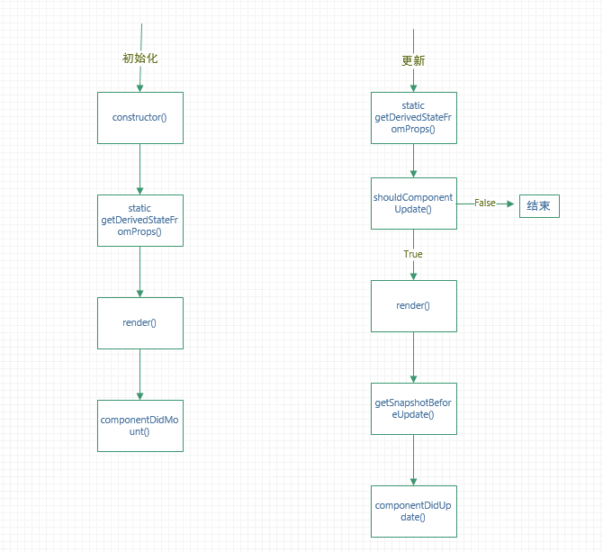

## 从零搭建一个基于React的开发模板
>目前加入了webpack4、Redux4、React16、React-Router4、Eslint、Mobx5

<strong>dones</strong>

+ 代码分离、异步路由
+ 热更新
+ eslint

<strong>todos</strong>

+ ... 
### react16 新生命周期

+ constructor

   如果组件没有需要初始化的state，就没必要实现它，同时this.props === undefined
   ```javascript
   constructor(props) {
    super(props);
    // 不要调用setState()
    this.state = { counter: 0 };
    // 不允许这么赋值state
    this.state = { color: props.color };
    this.handleClick = this.handleClick.bind(this);
    }
   ```
+ static getDerivedStateFromProps
```javascript
static getDerivedStateFromProps(nextProps, prevState) {
        // 只要调用render之前，都会触发它，这也是与componentWillReceiveProps的不同之处，由于是static，不能访问组件实例
        // 返回一个更新 state(状态) 的对象，或者返回 null 以不更新任何 state(状态)
        return null;
    }
```
+ getSnapshotBeforeUpdate
```javascript
    getSnapshotBeforeUpdate() {
        // 返回一个 snapshot，并且会在componentDidUpdate函数第三个参数中接收到
        return null;
    }
```
+ Class Properties
    + defaultProps
        ```javascript
        class CustomButton extends React.Component {
        // ...
        }
        // 只有实例的props undefined 时，才生效
            CustomButton.defaultProps = {
            color: 'blue'
        };
        render() {
            return <CustomButton /> ; // props.color 会被设置 blue
        }
        render() {
            return <CustomButton color={null} /> ; // props.color 依然是null
        }
        ```
    + displayName
    
        用在debug中
+ PureComponent 与 Component
    + Component 中 shouldUpdate 默认返回true，即使props没有变化
    + PureComponent 中的 shouldUpdate 对props, state进行浅比较，引用值没变不会调用render
### 加入Eslint
+ 安装相关插件eslint-loader 是在webpack配置中用到
```bash
npm i -D eslint eslint-loader eslint-plugin-react babel-eslint
```
+ 修改webpack 配置
```javascript
rules: [
            {
                enforce: "pre",
                test: /\.js(x)?$/,
                exclude: /node_modules/,
                loader: "eslint-loader",
            }
        ]
```
+ 创建.eslintrc文件，添加配置
```javascript
{
    "parser": "babel-eslint", // 将安装的babel-eslint配置上，否则回报import keyerror
    "parserOptions": {
        "ecmaVersion": 6,
        "sourceType": "module",
        "ecmaFeatures": {
            "jsx": true,
            "modules": true
        }
    },
    "env": {
        "es6": true, //es6 语法，可以使用set 等对象
        "browser": true // 使用浏览器中的全局变量
    },
    "extends": [
        "eslint:recommended",
        "plugin:react/recommended"
    ],
    "plugins": [
        "react"
    ],
    "rules": {
        "semi": ["error","never"], // 去掉分号，不过貌似；后续会加到规范中？
        "no-console": 0,
        "quotes": ["error", "single"], //单引号
        "no-unused-vars": 0,
        "react/prop-types": 0
    }
}
```
+ 配置eslint自动修复
```bash
"scripts": {
    "fix": "eslint --fix --ext .js,.jsx src"
  },
```
+ 代码中禁用eslint
```javascript
/* eslint-disable */
alert('foo');
/* eslint-enable */
alert('foo'); // eslint-disable-line
// eslint-disable-next-line
alert('foo');
/* eslint-disable-next-line */
alert('foo');
alert('foo'); /* eslint-disable-line */
```
### 加入各种webpack插件
#### webpack-bundle-analyzer
+ webpack-bundle-analyzer 插件，用于分析打包完成后各个文件之间的大小和关系
+ 安装
```javascript
    npm i -D webpack-bundle-analyzer
```
+ 配置
```javascript
plugins: [
        new BundleAnalyzerPlugin({
            analyzerPort:23000
        })
    ]
```
### mini-css-extract-plugin optimize-css-assets-webpack-plugin uglifyjs-webpack-plugin
+ 压缩js，用将css打包到一个文件，然后压缩
+ 安装
```bash
npm i -D uglifyjs-webpack-plugin mini-css-extract-plugin optimize-css-assets-webpack-plugin
```
+ 配置
```javascript
plugins: [
        new UglifyJSPlugin({
            uglifyOptions: {
                compress: {
                    drop_console: true // 是否删除代码中所有的console
                }
            }
        }),
        new OptimizeCSSAssetsPlugin({}), // 压缩css
        new MiniCssExtractPlugin({
            filename: devMode ? '[name].css' : '[name].[contenthash].css'
        })]
optimization: {
        splitChunks: {
            cacheGroups: {
                styles: {
                    name: 'styles',
                    test: /\.(sa|sc|c)ss$/, // css打包到同一个文件
                    chunks: 'all',
                    enforce: true
                }
            }
        }
    },
```
### babel-plugin-import
+ 配合antd，按需加載用到的组件
+ 安装
```bash
npm i -D babel-plugin-import
```
+ 配置
```javascript
"plugins": [
    [
      "import",
      {
        "libraryName": "antd",
        "libraryDirectory": "es",
        "style": "css"
      }
    ]
  ]
```
### react-loadable babel-plugin-syntax-dynamic-import
+ 代码分离，lazyload
+ 安装
```bash
npm i -S react-loadable
npm i -D babel-plugin-syntax-dynamic-import
```
+ 配置&用法
```javascript
// babelrc 文件配置
 "plugins": [
    "syntax-dynamic-import",
 ]

 // webpack 中增加配置，如果之前没配置过
 output: {
        chunkFilename: '[name].[chunkhash].js'
},

// 代码中的用法
onst LoadableXmap = Loadable({
    loader: () => import('@/components/xmap/demo'),
    loading: Loading,
})
const LoadableLearnRedux = Loadable({
    loader: () => import('@/view/learnRedux/index'),
    loading: Loading,
})
const LoadableHome = Loadable({
    loader: () => import('@/view/home/index'),
    loading: Loading,
})
const App = () => {
    return <Router>
        <div>
        <Switch>
            <Route exact path="/" component={LoadableXmap} />
            {/* <Route path="/map" component={LoadableXmap} /> */}
            <Route path="/home" component={LoadableHome} />
            <Route path="/learn" component={LoadableLearnRedux} />
            
        </Switch>
        </div>
    </Router>
}
```
### react-hot-loader
+ 开发过程中，热加载
+ 安装
```bash
npm i -D react-hot-loader
```
+ 配置
```javascript
// .babelrc
{
  "plugins": ["react-hot-loader/babel"]
}
// App.js
import React from 'react'
import { hot } from 'react-hot-loader'

const App = () => <div>Hello World!</div>

export default hot(module)(App)
```
### babel-plugin-transform-runtime babel-polyfill
+ 增加垫片
+ 安装
```bash
npm i -D babel-plugin-transform-runtime
npm i -S babel-polyfill
```
+ 配置
```javascript
// babelrc
{
  "plugins": ["transform-runtime"]
}
// 将babel-polyfill 直接打包
entry: {
        app: ["babel-polyfill", './src/index.js']
},
```
### Mobx 注意点
+ @observable observable
```javascript
class HomeStore {
    @observable a = []
    @observable b = []
    constructor() {
        this.a = this.b = observable([{name: '23423'}])
        console.log(this.a === this.b)// true
        this.a = this.b = []
        console.log(this.a === this.b)// false
    }
}
this
```
+ mobx 只会触发react 的render 函数，但render 函数自身会调用后续的生命周期
+ Array.isArray(observable([1,2,3])) === false
+ toJS 返回的 递归地将一个(observable)对象转换为 javascript 结构 this.observableData !== toJS(this.observableData)
+ 默认情况下将一个数据结构转换成可观察的是有感染性的，这意味着 observable 被自动应用于数据结构包含的任何值，或者将来会被该数据结构包含的值。
